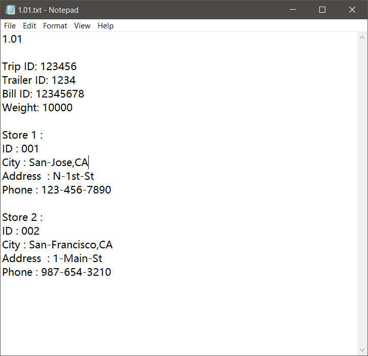

# myTruckerHistory

## Introduction

This project is inspired by my father's daily job as a truck driver. It manages the truck driver’s transport information and it provides functions to summarize, add, modify, and search transportation records or stores. It utilizes a csv file to store different stores' information which includes the ID, address, city, state, and phone number. To store the daily transportation record, it generates a txt file which includes Trip ID, Trailer ID, Bill ID, the weight of this trailer, and store information.


# Library

There are two external Java libraries utilized in this project which are commons-lang3-3.11 and opencsv-5.2. In order to run this project, these two libraries are required. 

If you're using Maven, one way to do is to add it as a dependency in the pom.xml file.

For commons-lang3-3.11
```
<dependency> 
    <groupId>com.opencsv</groupId> 
    <artifactId>opencsv</artifactId> 
    <version>4.1</version> 
</dependency> 
```

For opencsv-5.2
```
<dependency>
    <groupId>org.apache.commons</groupId>
    <artifactId>commons-lang3</artifactId>
    <version>3.11</version>
</dependency>
```

For VScode users, it can be done through the User Interface. I recommend checking the visual studio docs website. Link: https://code.visualstudio.com/docs/java/java-project

For Eclipse users, it can be done by right-clicking on the Project → Build Path → Configure Build Path. Under the Libraries tab, click Add Jars or Add External JARs and give the Jar.[1]

Otherwise, download the jar file under the lib folder and put the jar on your classpath.

# Transportation Record Example



# Reference

[1] Bragboybragboy (2010, July 19). How to import a jar in Eclipse. Retrieved on October 04, 2020, from https://stackoverflow.com/questions/3280353/how-to-import-a-jar-in-eclipse
